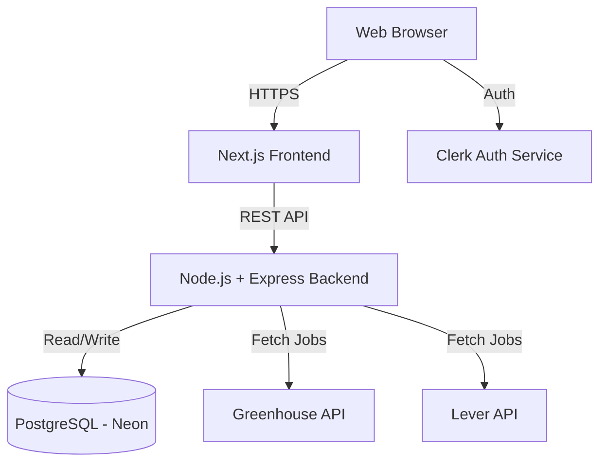
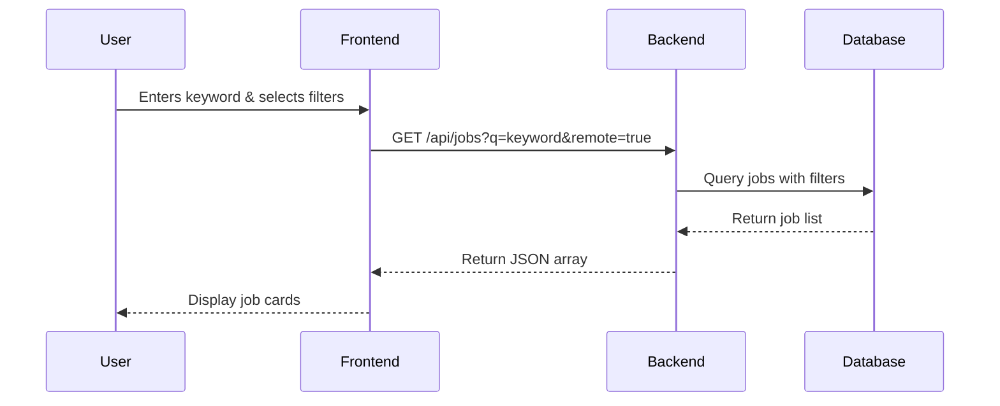
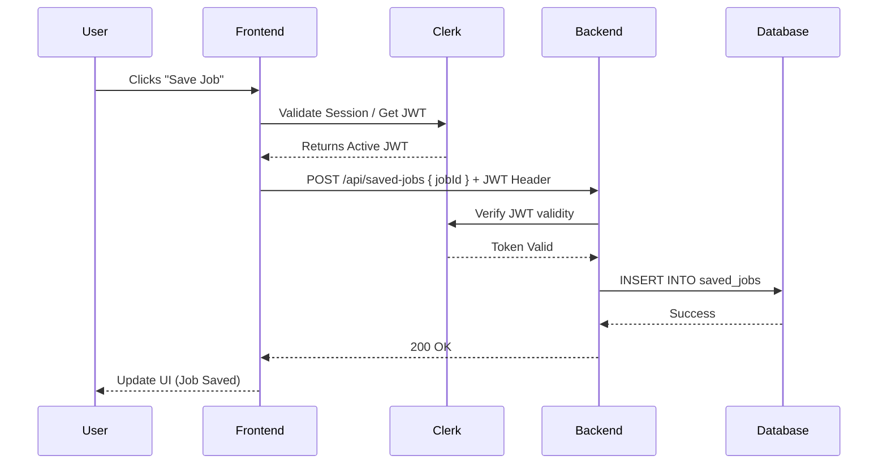
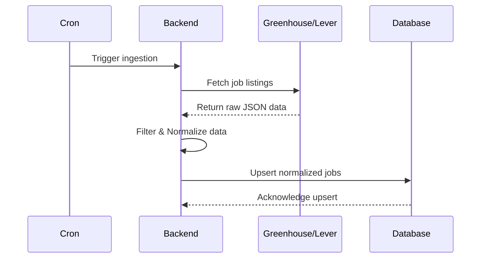

# APM Job Finder - System Architecture

## 1. High-Level Architecture Overview
The APM Job Finder platform is built on a modern, decoupled architecture using Next.js for the frontend and a Node.js/Express backend. It leverages specialized third-party services for database hosting (Neon) and authentication (Clerk).

## 2. Component Breakdown

### 2.1. Frontend App (Next.js)
- **Framework:** Next.js (App Router recommended)
- **Language:** TypeScript
- **Styling:** Tailwind CSS
- **Authentication:** Clerk React SDK (`@clerk/nextjs`)
- **Key Responsibilities:**
  - Rendering UI (Landing Page, Job Search, Job Details).
  - Client-side state management (search queries, filters).
  - Communicating with the Node.js backend.
  - Managing user sessions via Clerk.

### 2.2. Backend API (Node.js + Express)
- **Framework:** Express.js
- **Language:** TypeScript
- **Authentication Middleware:** Clerk Express SDK (to verify JWTs)
- **Key Responsibilities:**
  - Providing RESTful endpoints for the frontend (`/api/jobs`, `/api/saved-jobs`).
  - Handling pagination, searching, and filtering of job postings.
  - Managing user-specific data (saving/removing jobs).
  - Executing job ingestion scripts.

### 2.3. Job Aggregation Pipeline
- **Mechanism:** Scheduled background tasks (e.g., `node-cron` or dedicated worker).
- **Process:**
  1. **Fetch:** Pulls raw job postings from Greenhouse and Lever APIs.
  2. **Filter:** Identifies APM, PM, and related roles.
  3. **Normalize:** Converts disparate JSON structures into a unified `Job` schema.
  4. **Upsert:** Inserts new jobs and updates existing ones in the PostgreSQL database.

### 2.4. Database (PostgreSQL via Neon)
- **Type:** Relational Database
- **Hosting:** Neon (Serverless Postgres)
- **Schema Overview:**
  - `jobs`: Stores normalized job data (id, title, company, description, location, remote_status, url, source, created_at).
  - `users`: Stores minimal user info synced from Clerk (id, email).
  - `saved_jobs`: Junction table linking `users` and `jobs`.

## 3. Data Flow Diagrams

### 3.1. Job Search & Filter Flow

### 3.2. User Authentication & Saving a Job

### 3.3. Job Aggregation Ingestion

## 4. Security & Compliance
- **Authentication:** Fully managed by Clerk. Passwords and sensitive PII are never stored in the primary database.
- **API Security:** All backend endpoints modifying user data (e.g., saving a job) are protected by Clerk JWT middleware.
- **Database Security:** Neon uses secure connections (SSL/TLS). Queries will be parameterized (via Prisma or Drizzle ORM) to prevent SQL injection.

## 5. Future Scalability (V2 & V3 Considerations)
- **Analytics Dashboard (V2):** Requires analytical queries. May introduce a caching layer (Redis) if the database read load increases.
- **AI Features (V3):** Resume parsing and job scoring will require integrating OpenAI/Anthropic APIs. This will introduce asynchronous processing and potentially a queueing system (like BullMQ) to handle long-running AI tasks without blocking the Express server.
